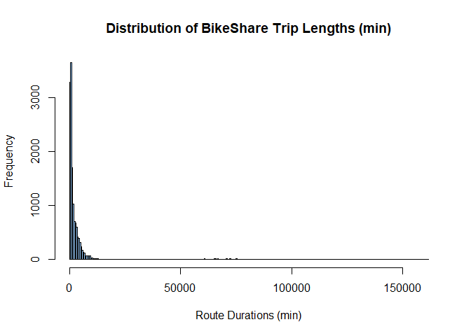
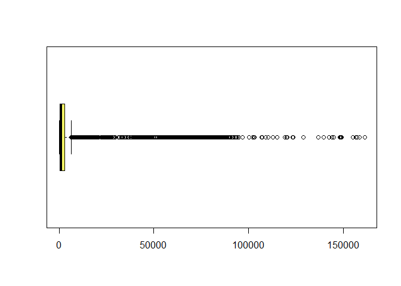
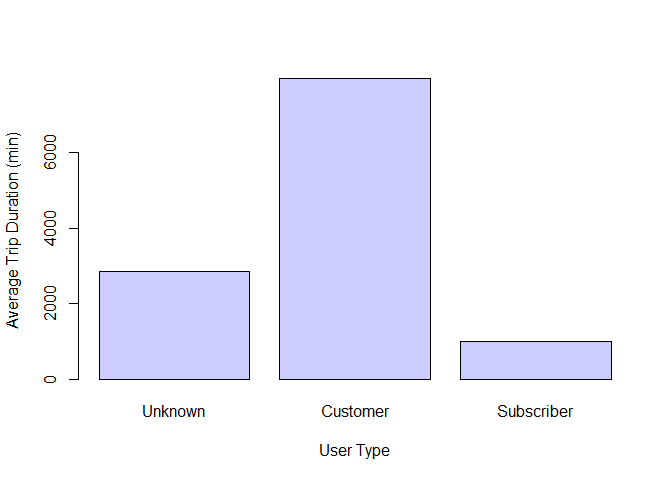

<!-- README.md is generated from README.Rmd. Please edit that file -->

# bikr

<!-- badges: start -->
<!-- badges: end -->

The goal of bikr is to present statistical analysis functionality for a
sample BikeShare Dataset for the city of Pittsburgh, PA, retrieved from
[](). This dataset presents trip data for \_\_\_ BikeShare rides during
the period \_\_\_\_. The bikr package provides high-level analysis
capabilities for BikeShare trip data, to compare trip lengths, time
durations, as well as trip characteristics by rider characteristics. A
number of additional data visualization components are also available,
including scatterplots, histograms and line charts.

## Installation

You can install the most recent version of bikr via:

``` r
if(!require(remotes)){
    install.packages("remotes")
    library(remotes)
}
remotes::install_github("vanveghd/bikr")
```

## Example

Various functions are available in the bikr package for data
visualization, statistical analysis and cross-referencing. The code
below is one function, which gives visual presentations of BikeShare
trip distances (histograms, length by date, etc.)

``` r
library(bikr)
## basic example code

bikr::visualize_route_durations()
```



## Functions available in first version of bikr

compare\_means() visualize\_route\_durations()

## References

*To access/download the initial dataset from Pittsburgh BikeShare:*  
<https://www.kaggle.com/adamscarroll/pittsburgh-healthy-ride-bikeshare-rentals-2021-q1>
